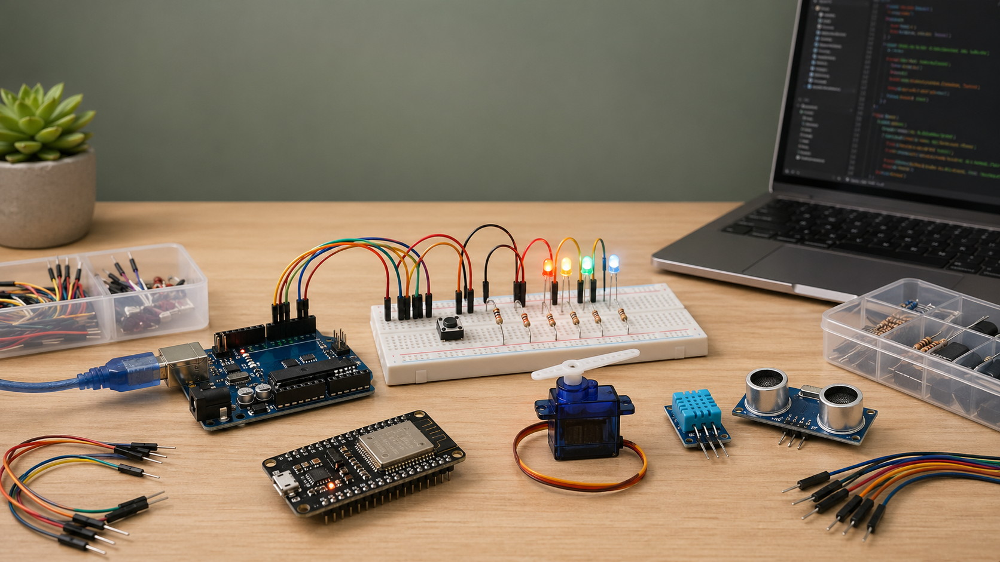

# Arduino Maker



Arduino Maker is an OpenClaw skill-pack plugin for Arduino, ESP32, and ESP8266
projects. It teaches an OpenClaw agent how to plan circuits, explain wiring,
generate complete sketches, and troubleshoot hardware bring-up.

## What It Provides

- A focused OpenClaw skill at `skills/arduino-maker/SKILL.md`
- Safe wiring guidance for common beginner and intermediate circuits
- Complete Arduino sketch standards with serial diagnostics
- Board references for Arduino Uno, Nano, ESP32, and ESP8266
- Component guides for LEDs, buttons, potentiometers, DHT sensors, servos, and HC-SR04
- Beginner, intermediate, and advanced project prompts
- Troubleshooting checklists for upload, compile, power, sensor, and I2C issues
- A generated README hero image at `assets/arduino-maker-hero.png`
- A local validation script for plugin metadata, skill frontmatter, release files, and markdown links

## Safety Scope

This plugin provides educational guidance for low-voltage Arduino-compatible
projects. Users are responsible for verifying wiring before applying power and
for using appropriate resistors, drivers, fuses, level shifting, isolation, and
enclosures for their hardware.

Do not use microcontroller pins to directly drive motors, mains voltage,
high-current loads, relays without suitable driver circuitry, or any
safety-critical system.

## OpenClaw Plugin Format

This project is packaged as a native OpenClaw plugin with a lightweight runtime
entrypoint and a declared skill root.

OpenClaw detects the plugin from:

- `package.json` with `openclaw.extensions`
- `openclaw.plugin.json`
- `skills/`

The manifest declares `skills: ["./skills"]`, so OpenClaw loads the bundled
skill when the plugin is enabled.

## OpenClaw Install

Install from npm after publication:

```bash
openclaw plugins install @sergiopesch/arduino-maker
openclaw gateway restart
openclaw plugins inspect arduino-maker
openclaw skills info arduino-maker
```

Install from this directory during development:

```bash
openclaw plugins install . --link
openclaw gateway restart
openclaw plugins inspect arduino-maker
openclaw skills list
```

For active local development without installing a packaged copy, add the repo to
`plugins.load.paths` and enable the plugin explicitly:

```json
{
  "plugins": {
    "load": {
      "paths": ["/home/sergiopesch/arduino-maker"]
    },
    "entries": {
      "arduino-maker": {
        "enabled": true,
        "config": {}
      }
    }
  }
}
```

## Development

Validate the plugin package and skill links:

```bash
npm test
node --check index.js
npm run pack:dry-run
```

The package also has `prepack` and `prepublishOnly` scripts that run release
checks automatically.

CI runs the same core checks on pushes and pull requests to `master`:

```bash
npm test
node --check index.js
npm pack --dry-run
```

The plugin intentionally keeps runtime behavior minimal. `index.js` is a no-op
entrypoint so OpenClaw can discover the package as a native plugin; the useful
behavior is the skill root declared in `openclaw.plugin.json`. It does not
register tools, hooks, services, or HTTP routes.

## Layout

```text
openclaw.plugin.json
package.json
index.js
assets/
  arduino-maker-hero.png
LICENSE
CONTRIBUTING.md
CHANGELOG.md
SECURITY.md
skills/
  arduino-maker/
    SKILL.md
    references/
scripts/
  validate-plugin.mjs
```

## Contributing

See [CONTRIBUTING.md](CONTRIBUTING.md) for safety and validation standards.

## Security

See [SECURITY.md](SECURITY.md) for vulnerability reporting and hardware-safety scope.

## License

MIT. See [LICENSE](LICENSE).
